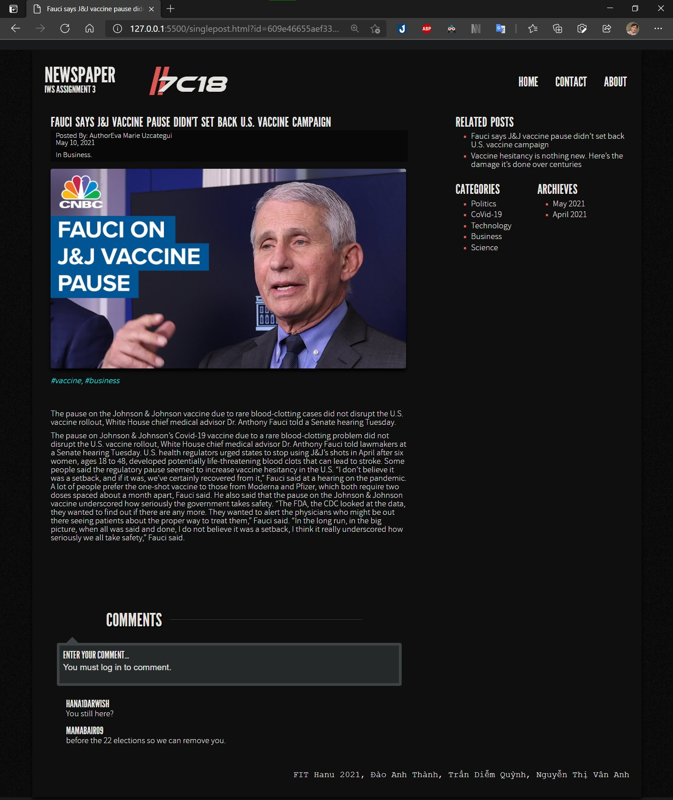

# news-paper-webapp
Basic newspaper site written in Java, HTML, CSS, JavaScript (developed based on Hanoi University's requirement)
---
This assignment demo how a simply web app works. The site alow user to view and put a comment below each article. There are several articles added as an example for demo purposes, however it may not work perfectly in other machine.
.

Other questions or requirement please contact me via  or .
---
Demo:

---
