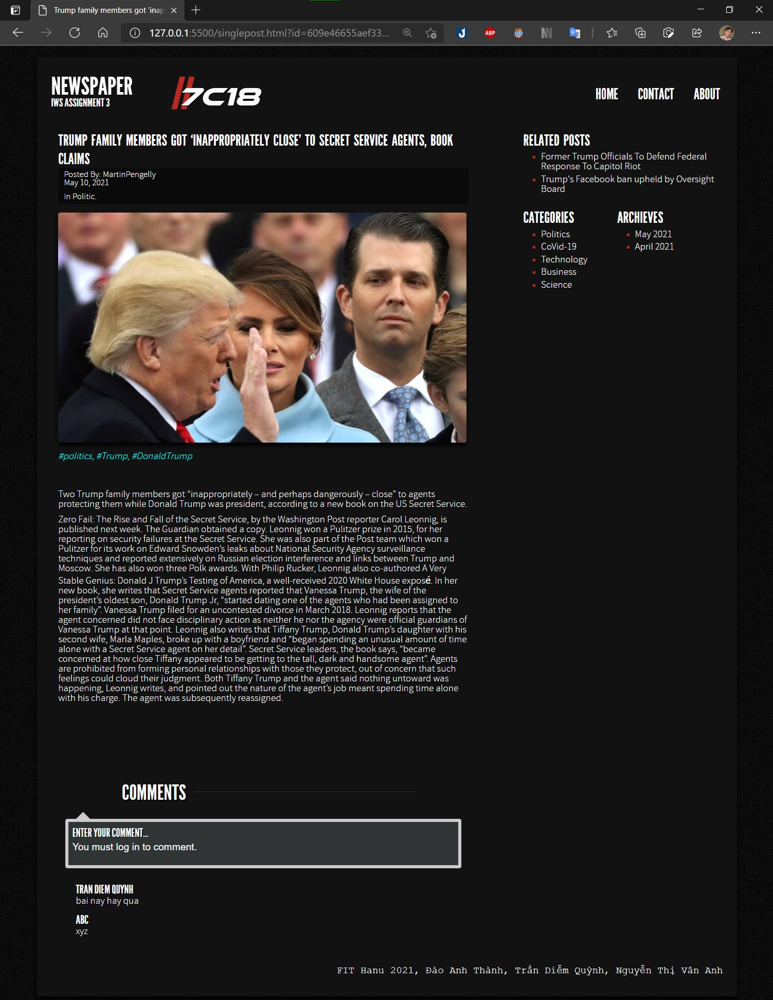

# News Application
Basic newspaper site written in Java, HTML, CSS, JavaScript (developed based on Hanoi University's requirement)
---
This assignment demo how a simply web app works. The site alow user to view and put a comment below each article. There are several articles added as an example for demo purposes, however it may not work perfectly on other machine.
[Link youtube for reference](https://www.youtube.com/watch?v=MhyoND-mgx4).

Other questions or requirements please contact me via [Twitter](https://twitter.com/sirEddieDao) or [LinkedIn](https://www.linkedin.com/in/daoanhthanh/) (Đào Anh Thành).

---
**Demo:**

Home page


A single article


**How it works**


---
## Installation
### Prequisite (or can use other similar tools)
- [Docker](https://www.docker.com/products/docker-desktop) (or [MongoDB](https://www.mongodb.com/)) installed (set db username=```root``` && password=```example```)
- Java 11.0.11 2021-04-20 LTS
- Apache Maven 3.8.1
- [Httpie](https://httpie.io/) (to inport data). 

### How to run
```Server```
1. Open terminal and navigate to ./server and run below commands:
2. ```docker-compose up```
3. ```mvn install```
4. ```java -jar target/iwsA3_server.jar```
5. ```http POST :1900/article/addAll > data.json``` to import data to db

```Client```
1. Navigate to ./client
2. Simply open index.html or can run it in ```live server```
