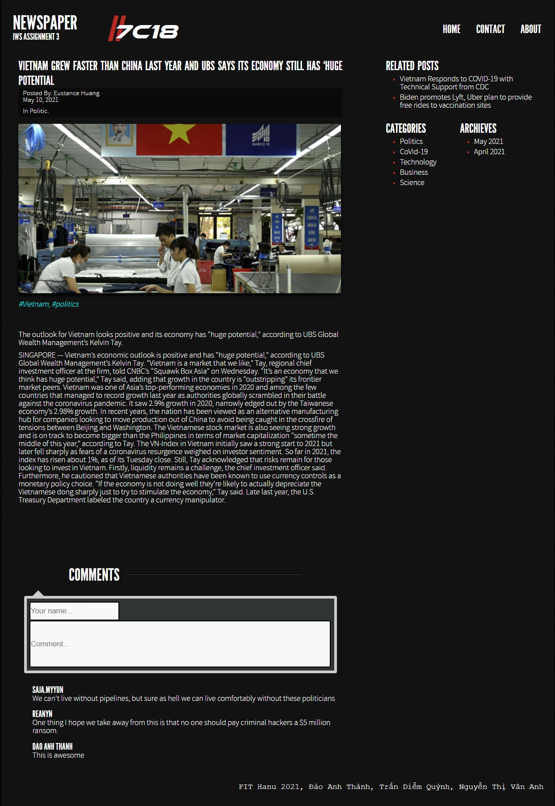

# News Application
Basic newspaper site written in Java, HTML, CSS, JavaScript (developed based on Hanoi University's requirement)
---
This assignment demo how a simply web app works. The site alow user to view and put a comment below each article. There are several articles added as an example for demo purposes, however it may not work perfectly in other machine.
[Link youtube for reference](https://www.youtube.com/watch?v=BqR3t9_RYTQ).

Other questions or requirement please contact me via [Twitter](https://twitter.com/sirEddieDao) or [LinkedIn](https://www.linkedin.com/in/daoanhthanh/) (Đào Anh Thành).

---
**Demo:**

Home page


A single article


---
## Installation
### Prequisite (or can use other similar environments)
- Docker (or MongoDB) installed (username=```root``` && password=```example```)
- Java 11.0.11 2021-04-20 LTS
- Apache Maven 3.8.1
- Httpie (to inport data). Installation link [here](https://httpie.io/)

### How to run
```Server```
1. Navigate to ./server
2. Open terminal and run ```docker-compose up```
3. Run ```mvn install```
4. ```java -jar target/iwsA3_server.jar```
5. Run ```http POST :1900/article/addAll > data.json``` to import data to db

```Client```
1. Navigate to ./client
2. Simply open index.html or can run it in ```live server```
